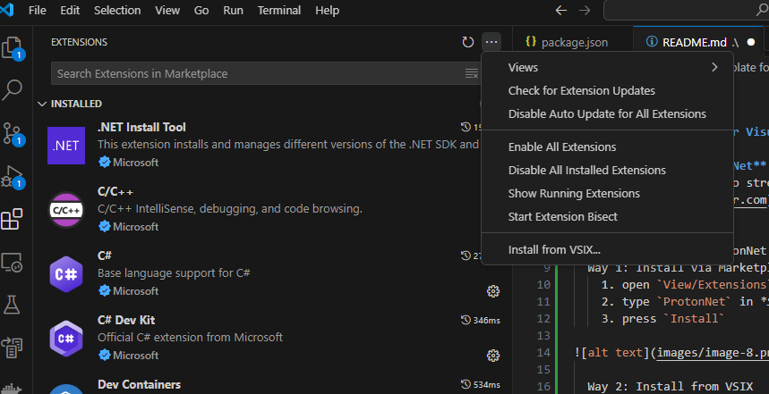

# ProtonNet Template for Visual Studio Code

Welcome to the **ProtonNet** template for Visual Studio Code!  
This tool is designed to streamline and optimize the development process for projects within the [ProtonNet Server](https://protonserver.net) ecosystem.

## I. How to install
Two way to install ProtonNet Template for Visual Studio Code, using Visual Studio Code:
* Install via Marketplace Extensions
  1. open `View/Extensions`
  2. type `ProtonNet` in *Search Extensions in Marketplace*, then Enter
  3. press `Install`

---
* Install from VSIX
  1. open `View/Extensions`
  2. download the newest release (example `protonnet-1.0.2.vsix`) ProtonNet Template for Visual Studio Code [Release](https://github.com/XmobiTea-Family/ProtonNet.Solution.VisualStudioCodeTemplate/releases)
  3. press `Install from VSIX...` like this picture then choose `ProtonNet Template` version, which you has download on step 2.

---
## II. Features

- **Create SocketServer Project** (for building `SocketServer` applications).
- **Create WebApiServer Project** (for building `WebApiServer` applications).

- **EventHandler**: Create a handler class to process events from the client (specific to `SocketServer`).
- **RequestHandler**: Create a handler class to process requests from the client.
- **WebApiController**: Create a controller class to handle API requests or browser access (specific to `WebApiServer`).
- **WebApiHtml**: Generate an HTML view for the web API (specific to `WebApiServer`).

## III. Requirements

- If your project uses **.NET Core**: Download **.NET** here: [Download .NET](https://dotnet.microsoft.com/en-us/download/dotnet)
- If your project uses **.NET Framework**: Download **.NET Framework** here: [Download .NET Framework](https://dotnet.microsoft.com/en-us/download/dotnet-framework)

## IV. Getting Started

### Creating a Project

1. Right-click on the root folder and select `[Proton Net] Create New Solution`.

2. On the `Configure your new project` screen:
   - Select the `Project Type` you need: `SocketServer Solution` for a SocketServer project or `WebApiServer Solution` for a WebApiServer project. In this guide, we will demonstrate how to create a `SocketServer Solution`.
   - Enter your `Project Name` (e.g., **MyFirstSocketServer**).
   - Choose the `Location` for your project (we recommend leaving it as the default).
   - Select the `ProtonNetVersion` from the available releases (see more [ProtonNet Releases](https://protonserver.net/release-note)).
   - Set the `Target Runtime` for your project. We recommend using .NET 8.0.
   - Click `Create` to generate your project.

3. After successful creation, your screen will look like this:

4. To test it out, click `Run/Start Debugging (F5)`.

5. After a successful build, you will see the following output in the `View/Debug Console`:

6. To stop debugging, click `Run/Stop Debugging`. Enjoy!

### Adding an Item

1. Right-click on the `MyFirstSocketServer\MyFirstSocketServer\Handlers\EventHandlers` folder and select `[Proton Net] Add New Item (EventHandler)` to add a new EventHandler. Follow the same process for `RequestHandler`, `WebApiController`, or `WebApiHtml` depending on your needs.
   
   Enter `MyFirstEventHandler` as the `Name`, check `With Model`, leave the `Location` as default, and click `Create`.

2. After successful creation, you will see a new file as shown:

3. Add your logic to the `Handle()` method and you're all set!

## V. Release Notes

### Version 1.0.0

- **ProtonNet Tool Support**:
  - Support for creating **SocketServer** projects under the [ProtonNet Server](https://protonserver.net) ecosystem.
  - Support for creating **WebApiServer** projects under the [ProtonNet Server](https://protonserver.net) ecosystem.

- **File Generators**:
  - Quickly and easily generate **WebApiController** files.
  - Generate **EventHandler** files to handle application events.
  - Generate **RequestHandler** files for managing and processing requests.
  - Generate **WebApiHtml** files for building web API interfaces.

---

**Enjoy your development with ProtonNet!**
